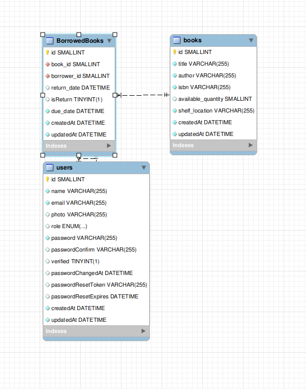
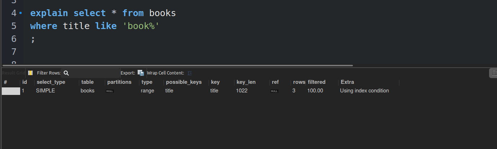

# Library-Management-System

The Library Management System is a software application designed to manage books and borrowers in a library. This system provides features to manage books, borrowers, and the borrowing process efficiently. It's built using Node.js, Express, and Sequelize for database interactions.

# Table of Contents

- [Technologies Used](#technologies-used)
- [Installation](#installation)
- [Database Diagram](#database-diagram)
- [API](#api)
- [Schema](#schema)
- [Notes](#notes)
- [Testing](#testing)

## Technologies Used

- Node.js
- Express
- MYSQL
- Sequelize (for database interactions)
- Docker and Docker Compose (optional, for containerization)

## Installation

To get started with the Library Management System, follow these steps:

1. Clone this repository to your local machine.
2. Change to the project directory.
3. Create a `.env` file in the project root and configure your environment variables. You can use the provided `.env.example` file as a template.

**.env.example**:

```
NODE_ENV=
PORT=8000
DB_NAME=
DB_USERNAME=
DB_PASSWORD=
DB_HOST=
DB_PORT=
JWT_SECRET_KEY=
JWT_COOKIE_EXPIRES_IN=
SENDGRID_APIKEY=
EMAIL_FROM=
```

4. Run the docker-compose file.

```
docker-compose up --build
```

## Database Diagram



## API:

**Books**:

```
[GET]    /books             # Retrieve a list of all books.
[POST]   /books             # Create a new book.
[GET]    /books/:id         # Retrieve details of a specific book.
[PATCH]  /books/:id         # Update details of a specific book.
[DELETE] /books/:id         # Delete a book.
[POST]   /books/borrow      # Borrow a book.
[PATCH]  /books/return      # Return a borrowed book.
```

**Users**:

```
[POST]    /signup                     #  Create a new user account.
[POST]    /login                      # Authenticate and log in a user.
[POST]    /forgot-password            # Initiate the password reset process.
[GET]     /verify-token/:resetToken   # Verify the reset token.
[GET]     /logout                     # Log out the user.
[GET]     /users/:id                  # Retrieve details of a specific user.
[PATCH]   /reset-password/:resetToken # Reset the password with a reset token.
[GET]     /users:                     # Retrieve a list of all users.
[PATCH]   /users/:id                  # Update details of a specific user.
[DELETE]  /users/:id                  # Delete a user. (Restricted to admin users)
[GET]     /me                         # Return current login user.
[GET]     /me/borrowedbooks           # Return current login user Borrowed Books.
```

**Borrowed Books**:

```
[GET]     /api/v1/bowrrowed                  # Get all borrowed books.
[GET]     /api/v1/bowrrowed/overdue          # Get overdue books.
[GET]     /api/v1/bowrrowed/:id              # Get details of a specific borrowed book.
[PATCH]   /api/v1/bowrrowed/:id              # Update details of a specific borrowed book.
[DELETE]  /api/v1/bowrrowed/:id              # Delete a borrowed book. (Restricted to admin users)
```

## Schema:

**Users**

| Column               | Type              |
| -------------------- | ----------------- |
| ID                   | UNSIGNED SMALLINT |
| Name                 | STRING            |
| Email                | STRING            |
| Photo                | STRING            |
| Role                 | STRING            |
| Password             | STRING            |
| PasswordConfirm      | STRING            |
| Verified             | BOOLEAN           |
| PasswordChangedAt    | DATE              |
| PasswordResetToken   | STRING            |
| PasswordResetExpires | DATE              |

**Books**

| Column             | Type              |
| ------------------ | ----------------- |
| ID                 | UNSIGNED SMALLINT |
| Title              | STRING            |
| Author             | STRING            |
| ISBN               | STRING            |
| Available Quantity | UNSIGNED SMALLINT |
| Shelf Location:    | VARCHAR(50)       |

**BorrowedBooks**

| Column      | Type              |
| ----------- | ----------------- |
| ID          | UNSIGNED SMALLINT |
| Book ID     | UNSIGNED SMALLINT |
| User ID     | UNSIGNED SMALLINT |
| Created AT  | DATETIME          |
| Return Date | DATETIME          |
| Due Date    | DATETIME          |
| Is Return   | BOOLEAN           |

## Notes

- I am currently using a normal, non-full-text index in the books schema for columns such as title, author, and ISBN. However, it's worth noting that implementing a full-text index has a significant impact on performance.
  
- I have disabled authorization on APIs that return Excel sheets to allow you to test them in a browser.
- I have completed all the tasks and bonuses in the assessment.

## Testing

You can test the API using the attached Postman collection, which includes examples.
[Postman Collection](./library.postman_collection.json)
